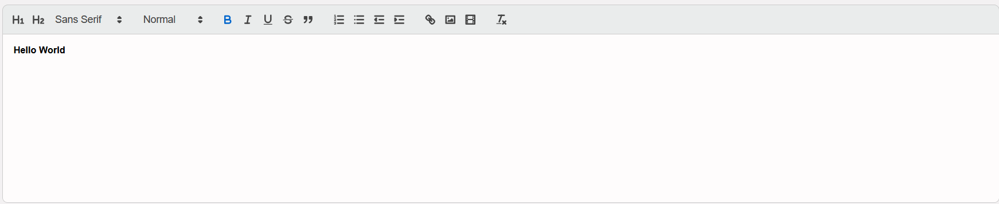
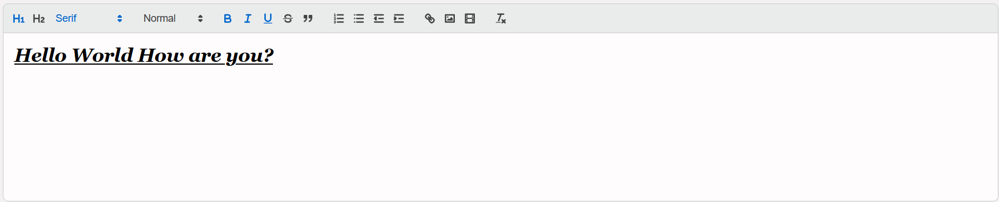

# HTML Text Editing Webpage

## Description
This is a simple and user-friendly HTML-based text editing webpage that allows you to edit and manipulate text conveniently. Whether you want to create a draft, format text, or try out HTML tags, this webpage is the perfect tool for you.

## Key Features

- **Text Editing:** Edit, cut, copy, and paste your text effortlessly.
- **Formatting:** Apply various formatting options such as bold, italic, underline, and more.
- **HTML Tags:** Experiment with HTML tags to see how they affect your text.
- **Auto Save:** Your text is automatically saved as you type, ensuring you don't lose your work.
- **Responsive Design:** The webpage is optimized for different screen sizes and devices.

## Demo

Check out the live demo [here](https://omkaarr1.github.io/CodeClauseInternship_Text_Editor/).

## How to Use

1. Clone the repository to your local machine.
2. Open the `index.html` file in your web browser.
3. Start typing and use the provided buttons to edit your text.

## Technologies Used

- HTML5
- CSS3
- JavaScript

## Screenshots

## Contributing

If you'd like to contribute to this project, please follow these steps:

1. Fork the repository.
2. Create a new branch for your feature or bug fix.
3. Make your changes and commit them with descriptive commit messages.
4. Push your changes to your fork.
5. Open a pull request, and we'll review your changes.

## Issues

If you encounter any bugs or have suggestions for improvements, please [open an issue](link_to_your_repository_issues) on this repository.

---

Happy text editing! If you find this project useful, feel free to star it or share it with others. Thank you for your support! 😊
